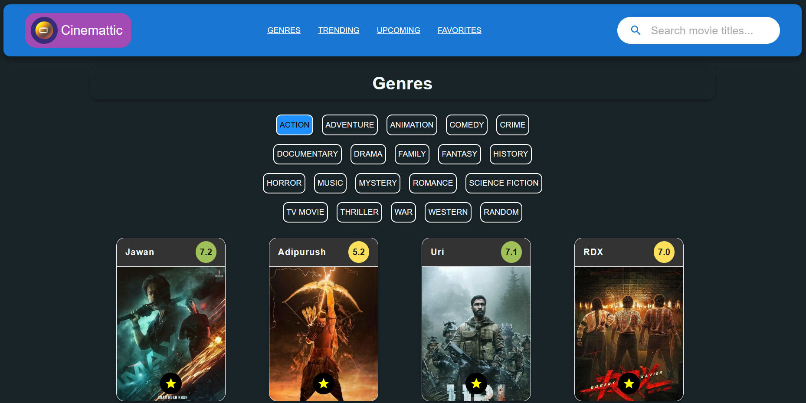
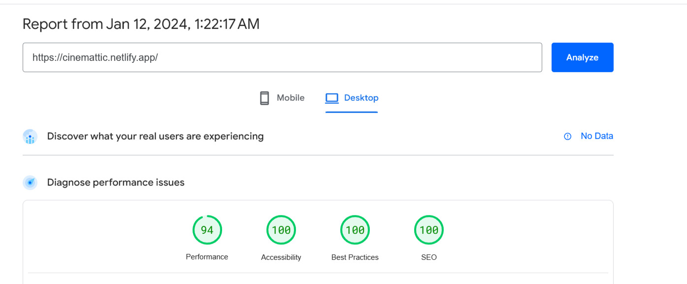

<div align="center">

<h1>Cinemattic</h1>

<p><a href="https://cinemattic.netlify.app/"><em>https://cinemattic.netlify.app/</em></a></p>

<p>Cinemattic is a user-friendly, feature-packed, and visually appealing movie website that allows users to search for movies by title, sort them by genre, view trending and upcoming movies, and favorite their desired movies.</p>
<hr/>


</div>

<hr/>

# 🍿 Features

- <i>Search movies:</i> users can search for movies by title
- <i>Watch trailers:</i> users can watch movie trailers easily
- <i>Genre-wise display:</i> movies can be sorted by genre
- <i>Trending Movies:</i> displays a section for trending movies
- <i>Upcoming movies:</i> displays a section for upcoming movies
- <i>Movie Details:</i> users can view detailed information about each movie
- <i>Favorite Movies:</i> users can favorite any movie they liked

<hr/>

# 💻 Tech Stack

Cinemattic is built with the following technologies:

- [ReactJS](https://react.dev/)
- [Vite](https://vitejs.dev/)
- [MUI](https://mui.com/)
- [TMDB](https://developer.themoviedb.org/docs/getting-started)

<hr/>

# ⚡ Pagespeed Test

Performance and accessibility are at the core of Cinemattic's design.
</br> https://pagespeed.web.dev/analysis/https-cinemattic-netlify-app/c6jjtnlflj?form_factor=desktop

</br>


<hr/>

# 🛠️ Build Locally

## 1. Download and Extract the Code

Firstly, download the entire website code and extract the ZIP file to a folder on your local system.

## 2. Obtain the TMDB API Key

Before starting the website, you will need to obtain the TMDB Movies API key and add it to your `.env` file.

## 3. Run the Website with Vite

Open your code editor of choice and navigate to the project directory. Then, open a terminal and run the following command:

```bash
pnpm run dev
```

This will start the application. Open a web browser and navigate to the specified localhost to access the website.

Note: Ensure that you have carefully added the TMDB API key to your `.env` file.

<hr/>
